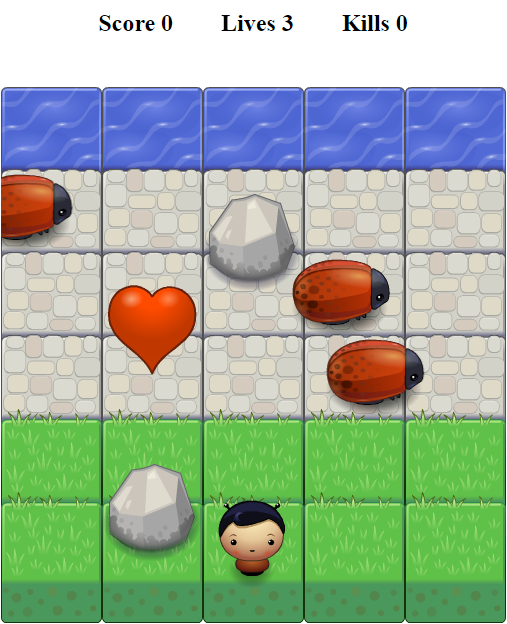
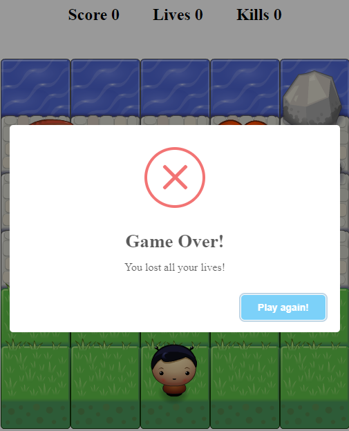
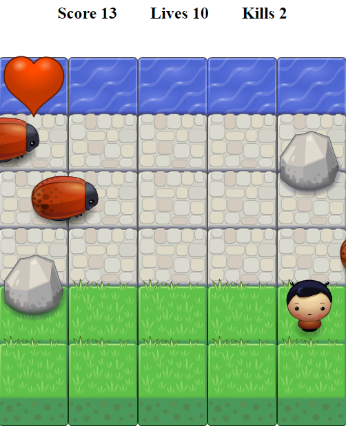

Udacity Classic Arcade Game
===============================

## Game

In this game you have a Player and Enemies. The goal of the player is to reach the water, without colliding into any one of the enemies. If player collides with the enemy, player moves to start position and loses one life. In the beginning player has 3 lives. If player collects the heart, player gets one life. If player hits the rock, player loses one life.
If player loses all lives, game starts from beginning. Once the player reaches the water the game is won.

## How to play

* Use arrow keys to move the player left, right, up and down.

## Preview

* Click [Here](https://msmatki.github.io/UdGame/) to Play the game.

## How to install

* To run this application, download the GitHub zip file or clone the repository.
* Unzip the file
* To start the game open the file index.html in your browser.  

## Screenshot

* Start game  

* player lost all lives, game over.  

* Try to reach water as many times possible with 0 kills  

## Built with 

* Html, Css, JavaScript

## External libraries Used

* Sweet Alert